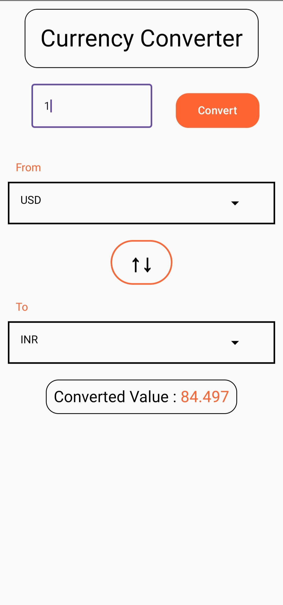

# Currency Converter App

## Technology Used
- **Android Studio**
- **Kotlin**
- **Jetpack Compose**
- **ExchangeRate API**

## Project Requirements
- Android Studio with proper configuration

## Steps to Run the Project
1. Download the ZIP file.
2. Extract the ZIP file.
3. Install Android Studio.
4. Open Android Studio and open the extracted file.
5. Wait for the Gradle file to install (if it doesn't install, make the necessary configuration according to Android Studio).
6. Once the **Run** button is active, you can run the app by connecting a device or using an emulator.

## APK Download Link
[Download the APK](https://drive.google.com/file/d/1G0EBw_Z-xXV180yp5CeEkei9JB-jL8Ap/view?usp=drive_link)
